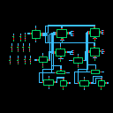
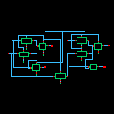
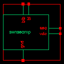
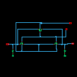
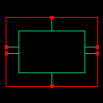
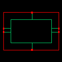

<p align="center">
  <h1 align="center">Reconfigurable 10T SRAM 2×2 Array with Efficient Compute-In-Memory (CIM)</h1>
</p>

<p align="center">
  
  
  
  
</p>

---

## 📜 Abstract

This project presents the design and simulation of a **Reconfigurable 10-Transistor (10T) SRAM cell** and its **2×2 array** for **Compute-In-Memory (CIM)** applications, implemented in **90nm CMOS technology** using **Cadence Virtuoso**.

The conventional von Neumann architecture suffers from the *memory wall* problem — frequent data transfers between the processor and memory create a bottleneck in terms of latency, bandwidth, and energy. **CIM** addresses this by performing logical and arithmetic computations **directly inside the memory array**, eliminating expensive data movement.

The proposed 10T SRAM topology features:
- **6T core for weight storage** — Cross-coupled inverters with write access transistors for robust data retention
- **3T external read port** — Provides isolated, single-ended read access decoupled from storage nodes, eliminating read-disturb issues
- **1T HVT NMOS compute transistor** — High-threshold voltage transistor enables in-memory AND computation with minimal leakage
- **~22% power reduction** compared to existing CIM SRAM designs

This design is highly suitable for **AI/Edge computing**, **IoT devices**, and **neural network accelerators** where low power and high throughput are critical.

---

## 🏗️ Architecture & Design

### 10T SRAM Bitcell

The 10T cell consists of:
- **6T Storage Core** — Cross-coupled inverters (M1–M4) with write access transistors (M5–M6) for storing weight/data with robust retention
- **3T External Read Port** — Transistors M7, M8, and M9 provide a buffered, single-ended read path completely isolated from the storage nodes, eliminating read-disturb issues
- **1T HVT NMOS Compute Transistor** — M10, a high-threshold voltage NMOS controlled by the **Compute Word Line (CWL)**, enables in-memory AND operations with suppressed leakage current

### 2×2 SRAM Array

The complete array integrates the following peripheral circuitry:
| Block | Function |
|:---|:---|
| **SRAM Cell (10T)** | 6T storage + 3T read port + 1T HVT compute |
| **Precharge Circuit** | Pre-charges bitlines (BL, BLB) to VDD before read/write |
| **Sense Amplifier** | Amplifies small differential voltage on bitlines during read |
| **Write Driver** | Drives full-swing data onto bitlines during write operations |
| **Row Decoder** | Selects the appropriate word line (WL) based on address |
| **Isolation Circuit** | Isolates the bitlines during CIM operations to prevent data corruption |

---

## 📊 Performance Results

### Single Cell Performance (90nm, VDD = 1.0V)

| Parameter | Value | Unit |
|:---|---:|:---|
| **Power Consumption** | 17.06 | µW |
| **Read Access Time** | 20 | ps |
| **Write Access Time** | 63 | ps |
| **Read SNM (Static Noise Margin)** | 439 | mV |
| **Hold SNM** | 508 | mV |

### 2×2 Array Performance

| Parameter | Value | Unit |
|:---|---:|:---|
| **Total Power Consumption** | 80 | µW |
| **Read Access Time** | 40 | ps |
| **Write Access Time** | 83 | ps |

### Comparison with Existing Designs

| Design | Technology | Power | Read Time | Write Time |
|:---|:---|---:|---:|---:|
| Conventional 6T SRAM | 90nm | ~22 µW | ~50 ps | ~90 ps |
| Standard 8T CIM | 90nm | ~21 µW | ~35 ps | ~75 ps |
| **This Work (10T CIM)** | **90nm** | **17.06 µW** | **20 ps** | **63 ps** |

> **Key Achievement:** ~22% power saving with significantly improved read access time compared to existing CIM architectures.

---

## 🔬 Simulation Details

- **Simulator:** Spectre (Cadence)
- **Analysis Type:** Transient Analysis (0 to 100ns)
- **Supply Voltage:** 1.0V
- **Technology:** 90nm CMOS (gpdk090)
- **Waveform Viewer:** Cadence ViVA

### Key Signals Monitored
| Signal | Description |
|:---|:---|
| `WL` | Word Line — enables read/write access |
| `WWL` | Write Word Line — controls write access transistors |
| `CWL` | Compute Word Line — enables in-memory AND operation |
| `BL / BLB` | Bitline / Bitline Bar — carry data during read/write |
| `RBL` | Read Bitline — isolated read output |
| `Q / QB` | Internal storage nodes of the SRAM cell |

---

## 📂 Repository Structure

```
Reconfigurable-10T-SRAM-CIM/
├── LICENSE                          # Apache 2.0 License
├── README.md                        # This file
├── .gitignore                       # Excludes Cadence temp/lock files
│
├── CIM/
│   ├── readme.md                    # Quick-reference project summary
│   ├── cds.lib                      # Cadence library definitions
│   │
│   ├── reports/
│   │   └── CIM_REPORT.pdf           # Full project report (PDF)
│   │
│   └── CIM_project/                 # Cadence OpenAccess Library
│       ├── cdsinfo.tag              # Library tag file
│       ├── .oalib                   # OA library descriptor
│       │
│       ├── sram/                    # 10T SRAM Bitcell
│       │   ├── schematic/           # Schematic view (sch.oa)
│       │   └── symbol/              # Symbol view (symbol.oa)
│       │
│       ├── sram_array/              # 2×2 SRAM Array (top-level)
│       │   └── schematic/
│       │
│       ├── sram_symbol/             # SRAM with symbol wrapper
│       │   ├── schematic/
│       │   └── symbol/
│       │
│       ├── and/                     # In-memory AND gate
│       │   ├── schematic/
│       │   └── symbol/
│       │
│       ├── decoder/                 # Row Address Decoder
│       │   ├── schematic/
│       │   └── symbol/
│       │
│       ├── sense_amp/               # Sense Amplifier
│       │   ├── schematic/
│       │   └── symbol/
│       │
│       ├── precharge/               # Bitline Precharge Circuit
│       │   ├── schematic/
│       │   └── symbol/
│       │
│       ├── writedriver/             # Write Driver
│       │   ├── schematic/
│       │   └── symbol/
│       │

│       ├── isolation/               # Isolation Circuit
│       │   ├── schematic/
│       │   └── symbol/
│       │
│       ├── inverter/                # Inverter (utility cell)
│       │   ├── schematic/
│       │   └── symbol/
│       │
│       ├── sram_analysis/           # Simulation Testbench
│       │   ├── schematic/
│       │   └── spectre_state1/      # Spectre ADE simulation config
│       │
│       ├── verify/                  # Verification testbench
│       │   └── schematic/
│       │
│       ├── ReadSNM/                 # Read SNM analysis testbench
│       │   └── schematic/
│       │
│       └── WriteSNM/                # Write SNM analysis testbench
│           └── schematic/
│
└── Images/                          # Schematic thumbnails (auto-exported)
    ├── sram_schematic.png
    ├── sram_symbol.png
    ├── sram_array_schematic.png
    ├── and_schematic.png
    ├── decoder_schematic.png
    ├── sense_amp_schematic.png
    ├── precharge_schematic.png
    ├── writedriver_schematic.png
    ├── isolation_schematic.png
    └── ...
```

---

## 📸 Schematic Previews

> **Note:** The images below are 128×128 pixel thumbnails auto-generated by Cadence Virtuoso. For full-resolution schematics, open the `.oa` files in Cadence Virtuoso or refer to the [project report (PDF)](reports/CIM_REPORT.pdf).

### 10T SRAM Cell
| Schematic | Symbol |
|:---:|:---:|
|  |  |

### 2×2 SRAM Array
| Top-Level Array Schematic |
|:---:|
|  |

### Peripheral Circuits

| Circuit | Schematic | Symbol |
|:---:|:---:|:---:|
| **AND Gate** |  |  |
| **Decoder** |  |  |
| **Sense Amplifier** |  |  |
| **Precharge** |  |  |
| **Write Driver** |  |  |
| **Isolation** |  |  |

---

## 🛠️ Tools & Technologies

| Tool | Purpose |
|:---|:---|
| **Cadence Virtuoso** | Schematic capture & layout design |
| **Spectre Simulator** | Transient, DC, and noise analysis |
| **Cadence ViVA** | Waveform viewing and measurement |
| **Cadence ADE-L** | Analog Design Environment for simulation setup |
| **Technology PDK** | gpdk090 (90nm Generic Process Design Kit) |

---

## 🚀 Getting Started

### Prerequisites
- **Cadence Virtuoso IC6.1.5** (or later) with Spectre simulator
- **90nm PDK** (gpdk090) installed and configured
- Linux environment (RHEL / CentOS recommended for Cadence tools)

### Opening the Design
1. Clone this repository:
   ```bash
   git clone https://github.com/Jeyapranov/Reconfigurable-10T-SRAM-CIM.git
   ```
2. Open Cadence Virtuoso and add the library path:
   ```
   DEFINE CIM_project <your_path>/CIM/CIM_project
   ```
   Add this line to your `cds.lib` file.
3. Open the **Library Manager** → Navigate to `CIM_project` → Open any cell's `schematic` view.
4. For simulation, open `sram_analysis/schematic` and load the ADE state from `spectre_state1/`.

### Running Simulations
1. Open `sram_analysis` → `schematic` view
2. Launch **ADE-L** (Analog Design Environment)
3. Load simulation state: `File → Load State → spectre_state1`
4. Click **Netlist and Run** to execute the transient simulation
5. View results in ViVA waveform viewer

---

## 📄 Documentation

- **[Full Project Report (PDF)](reports/CIM_REPORT.pdf)** — Comprehensive report including theory, design methodology, simulation results, and analysis.

---

## 🔄 CIM Operation Explained

### Standard SRAM Mode
1. **Write:** Assert `WWL`, drive `BL`/`BLB` with data → data stored in cross-coupled inverters
2. **Read:** Assert `WL`, precharge `RBL` → M7/M8 discharge `RBL` based on stored value → sense amplifier detects

### Compute-In-Memory (AND) Mode
1. Store operands in two SRAM cells in the same column
2. Assert `CWL` for both rows simultaneously
3. The `RBL` (Read Bitline) naturally computes the **AND** of stored values through series-connected transistors
4. Result is sensed on the bitline without moving data to the processor

```
Cell 1: Q1 = 1, CWL1 = 1 → M9 ON
Cell 2: Q2 = 1, CWL2 = 1 → M10 ON
Result: RBL discharges → AND = 1

Cell 1: Q1 = 1, CWL1 = 1 → M9 ON
Cell 2: Q2 = 0, CWL2 = 1 → M10 OFF
Result: RBL stays high → AND = 0
```

---

## 🤝 How to Contribute

We welcome contributions to improve this project! Here's how:

1. **Fork** the repository on GitHub
2. **Clone** your fork locally:
   ```bash
   git clone https://github.com/<your-username>/Reconfigurable-10T-SRAM-CIM.git
   cd Reconfigurable-10T-SRAM-CIM
   ```
3. **Create a feature branch:**
   ```bash
   git checkout -b feature/your-improvement
   ```
4. **Make your changes** and stage them:
   ```bash
   git add .
   git commit -m "Add: description of your changes"
   ```
5. **Push** to your fork and open a **Pull Request:**
   ```bash
   git push origin feature/your-improvement
   ```

### Contribution Ideas
- Add layout views (GDS-II) for the cells
- Implement additional CIM operations (OR, XOR, MAC)
- Port the design to advanced technology nodes (45nm, 28nm)
- Add Monte Carlo / corner analysis results
- Create SPICE netlists for cross-tool verification

---

## 📚 References

1. A. Agrawal *et al.*, "X-SRAM: Enabling In-Memory Boolean Computations in CMOS Static Random Access Memories," *IEEE TCAS-I*, 2018.
2. S. Jeloka *et al.*, "A 28nm Configurable Memory (TCAM/BCAM/SRAM) Using Push-Rule 6T Bit Cell Enabling Logic-in-Memory," *IEEE JSSC*, 2016.
3. N. Verma and A. P. Chandrakasan, "A 256 kb 65 nm 8T Subthreshold SRAM Employing Sense-Amplifier Redundancy," *IEEE JSSC*, 2008.
4. J. P. Kulkarni *et al.*, "A 160 mV Robust Schmitt Trigger Based Subthreshold SRAM," *IEEE JSSC*, 2007.

---

## 📝 License

This project is licensed under the **Apache License 2.0** — see the [LICENSE](LICENSE) file for details.

---

<p align="center">
  <b>⭐ If you found this project useful, please give it a star!</b>
</p>
